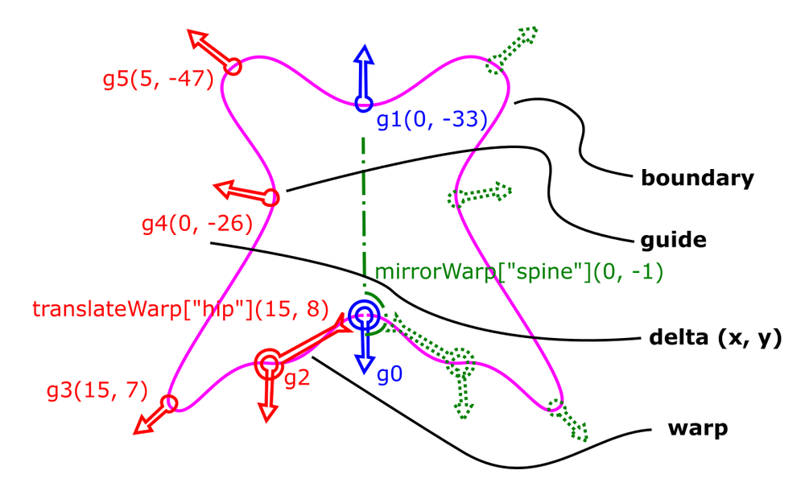

# butterfly cad

2d form description library written in go and transpiled to javascript
with webgl

[live beetle example](http://philetus.github.io/beetle_example.html)

presented at the chi 2016 workshop on cross-disciplinary fabrication -
[pdf](butterfly_cad_camera_ready.pdf)

